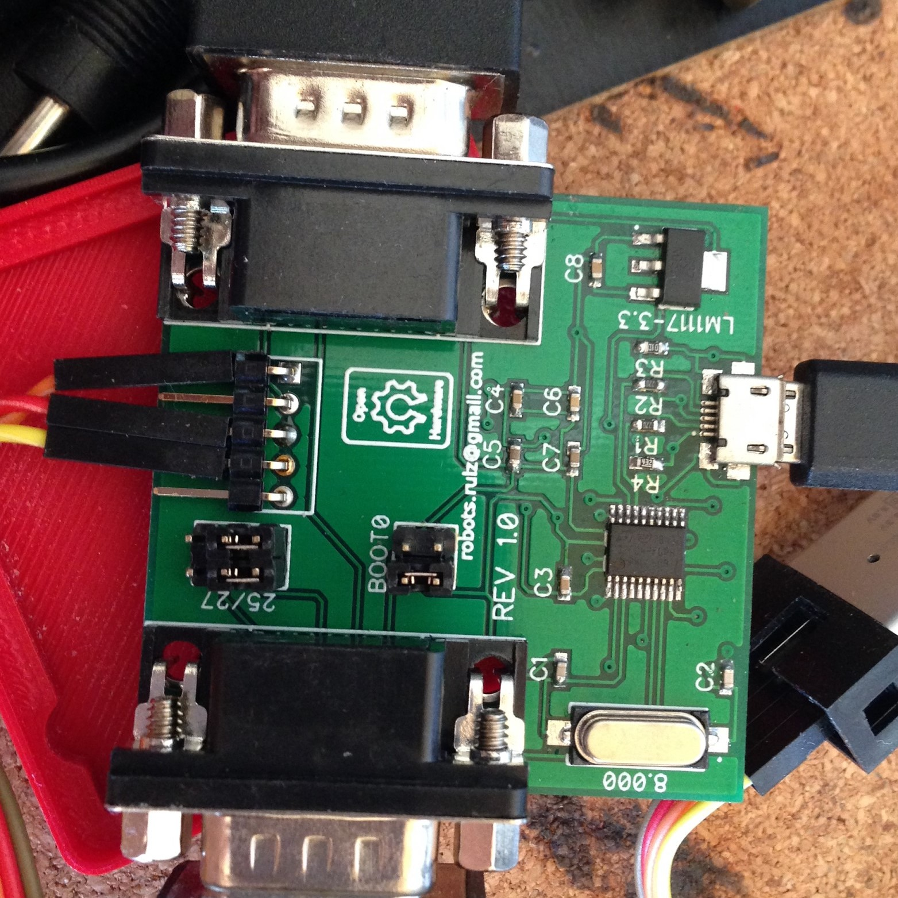

Logitech G25/G27 pedals/shifter adapter
=======================================

The idea behind this project is to create open and inexpensive USB HID adapter for Logitech G25 / G27 pedals and shifters based on affordable components. Once you bought (or built) your new shiny and awesome direct drive steering wheel you no longer need your old but still working Logitech wheel. But it parts still can be used as standalone device.

I am aware that some shops already sell similar adapters. Unfortunately these devices are quite expensive and not open source. Also I want to practice a bit with STM32 programming :)

Hardware part is based on STM32F042 microcontroller(TSSOP20), Schematics folder contains Gerber files as well as DipTrace source files.

"Stable" firmware:

 [hse-calibration-flash-1.2.dfu](binaries/hse-calibration-flash-1.2.dfu)
 
 [hse-calibration-flash-1.2.hex](binaries/hse-calibration-flash-1.2.hex)

Calibration software (Windows x86):

 [SP_Profiler_1.2.exe](binaries/SP_Profiler_1.2.exe)

## Obtaining the board

PCB is available to order on [kitnic.it](https://kitnic.it/boards/github.com/robotsrulz/SP_Adapter/). I'm testing data for 1clickBOM Chrome plugin to order all parts from major component suppliers (Digikey, Mouser, RS, Newark, Farnell). I'm also selling a small amount of the boards assembled manually by myself, contact me if you want one.

## USB VID/PID

The board uses VID 0x1209 (InterBiometrics) / PID 0xF00D to identify itself, see [pid.codes](http://pid.codes/1209/F00D/) database.

## License

This project is licensed under the BSD License - see the [LICENSE](LICENSE) file for details
